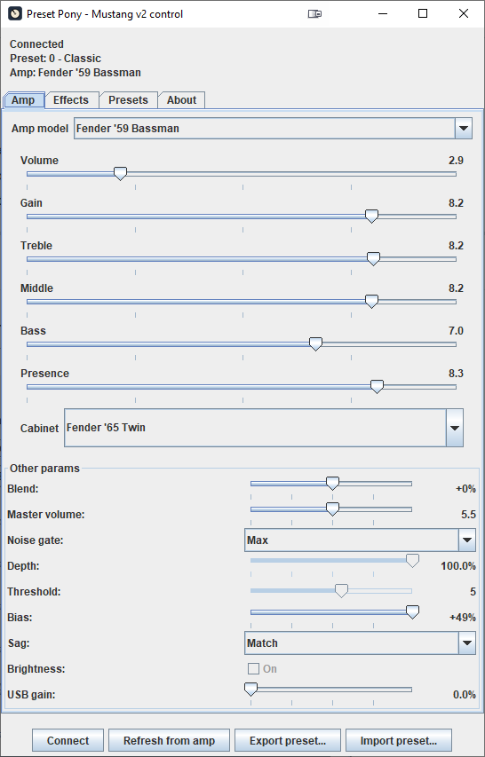
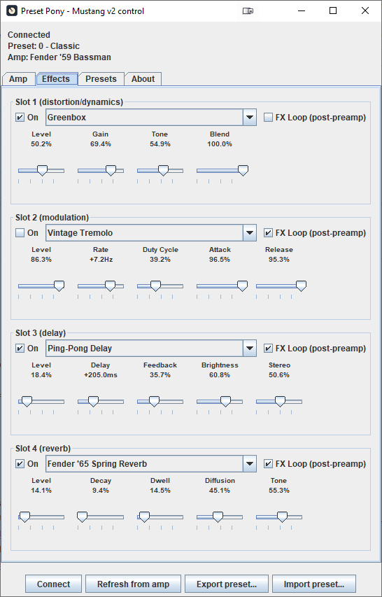
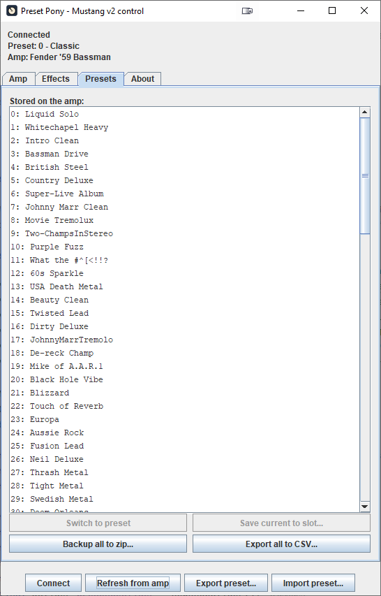

# Preset Pony — Fender Mustang III/IV/V Companion Application

A Java application to replace the discontinued Fender Fuse software for programming Mustang III (and probablly IV and V) v2 amps over USB. It allows control of the same amplifier and effect parameters as Fender Fuse: preset switching, import from file, export to a single file, and bulk export to ZIP or CSV.

This project is written independently, informed by prior reverse-engineering work on the Mustang USB protocol — see Attribution below.

## About

Preset Pony connects over USB to Fender Mustang III V2 amplifiers, giving you the same amp-model, effect, and preset control that Fender's own (now discontinued) Fuse software provided. Mustang III V1 amps use a similar but not identical USB protocol - some V1 units may partially work, but V1 is not a supported or tested target. Other amps in the Mustang v2 family may work as they also used Fender Fuse. Any amp using the later Tone program likely will not work.

**Disclaimer:** This is an independent, unofficial tool with no affiliation to or endorsement from Fender. It talks directly to your amplifier's USB control interface, including writing settings back to it. **Use it at your own risk.** The developers accept no responsibility or liability for any damage to your amplifier, computer, or other equipment, or for any lost presets, arising from use of this software. The same information is shown in the app's About tab.


---

## Features

- **Connect to amp** over USB HID (no driver installation required on Windows/macOS/Linux)
- **Live control**: adjust amp settings and effects in real-time
- **Preset management**:
  - Read all 100 stored presets from the amp
  - Save/export presets as Fuse-compatible `.fuse` XML
  - Import `.fuse` presets from Fuse
  - Bulk backup all 100 presets to ZIP
  - Export all presets to CSV
- **Effect editing**: configure distortion, modulation, delay, and reverb effect chains
- **FX Loop support**: pre/post-preamp effect placement toggle

---

## Screenshots

### Main Window — Amp Tab


### Effects Tab


### Presets Tab


---

## Hardware Support

**Target**: Fender Mustang III v2 (USB VID `0x1ED8` / PID `0x0016`). Other Mustang (I to V) v1 or v2 amps may work but are untested.


## System Requirements

- **Java**: JDK 17+ (uses records, pattern matching, jpackage)
- **OS**: Windows 10/11, Linux, macOS
- **Hardware**: USB connection to Fender Mustang III v2 amp (VID `0x1ED8` / PID `0x0016`). Other amps in the Mustang series may work, but have not been tested.

---

## Running the app ##

The releases section has the app available as Windows files, or as a jar file for those already with a Java installation.

### Windows version

Download the zip file to a location of your choice, and unzip.  It contains a small exe, the Java application and a Java runtime.  Double click the PresetPony.exe, which should launch the application.

### Java version (far smaller)

Download the jar file, and run by using the terminal, or command line with `java -jar preset-pony.jar`. Some Java installations allow you to double click the jar file.

## Building

Build scripts need `javac` on the system PATH.

### Linux/macOS

```bash
./compile.sh
```

### Windows

```cmd
compile.bat
```

### Manual Compilation

```bash
# Compile main application
javac -d build \
  -cp lib/hid4java-0.8.0.jar:lib/jna-5.19.1.jar:lib/jna-platform-5.19.1.jar \
  src/main/java/com/electrosparkles/presetpony/*.java
```

---

## Running from source

### Main Application (GUI)

Scripts need `java` on the system PATH.

```bash
./run.sh              # Linux/macOS
run.bat               # Windows
```

Or manually:

```bash
java --enable-native-access=ALL-UNNAMED \
  -cp build:lib/hid4java-0.8.0.jar:lib/jna-5.19.1.jar:lib/jna-platform-5.19.1.jar \
  com.electrosparkles.presetpony.PresetPony
```

### Building a runnable JAR

```bash
./build-jar.sh         # Linux/macOS
build-jar.bat          # Windows
```

Produces `build/jar/preset-pony.jar`, runnable with `run-jar.sh` / `run-jar.bat`.

### Building a native app (jpackage)

```bash
./build-exe.sh         # Linux - produces dist/PresetPony plus a .desktop file
build-exe.bat          # Windows - produces dist\PresetPony\PresetPony.exe
```

Requires JDK 17+ with `jpackage` on the PATH. See the script headers for details.

---

## Known Limitations

- No live panel sync - Amp/Effects only update on Connect/Refresh
- Single connected amp at a time
- V1 amps not supported/tested
- One known unidentified packet type (`DSP=0x0a`) seen on the wire whose function is unknown - not required for presets to work

---

## Troubleshooting

### USB Connection Issues

- **On Windows**: confirm the Mustang III v2 shows as a HID-compliant device in Device Manager (not "unknown device")
- **On Linux**: may require a udev rule for non-root USB access
- **On macOS**: should work out of the box via the HID framework

### Preset Import Fails

- Ensure the `.fuse` file is UTF-8 (Fuse saves Windows-1252 on some systems; convert if needed)

### Live Control Lag

- USB timing is sensitive; the amp introduces roughly 100–200 ms latency between sending a parameter change and the panel updating

---

## License

MIT - see [LICENSE](LICENSE).

This project is written independently of offa/plug (not a port), informed by its reverse-engineering of the Mustang USB protocol. offa/plug itself is GPLv3-licensed; no offa/plug source is copied here.

---

## Attribution

Reverse-engineering references used during development:

- [offa/plug](https://github.com/offa/plug) (GPLv3, C++/Qt)
- jtangelder/refuse (TypeScript, web-based, independent cross-check)
- Fender's own Fuse software (Windows, Silverlight, now discontinued)
- The [Fender Mustang Amps and Fuse Fandom wiki](https://fender-mustang-amps-and-fuse.fandom.com/wiki/) for amp/cabinet/effect display names


---

## Contributing

Bug reports and pull requests welcome via the issue tracker.

---

## Trademark and Brand Acknowledgments

This software is an independent, unofficial companion tool and is not affiliated with, endorsed by, or approved by any of the following trademark/brand owners:

**Amplifier Brands & Models**: Fender (Mustang, Deluxe, Champ, Princeton, Twin, Super-Sonic), Marshall (Plexi, JCM 800), Vox (AC30), Mesa/Boogie (Dual Rectifier), Peavey (5150), Orange (Custom Shop), HiWatt (DR103). These amp model names and their sonic characteristics are the property of their respective manufacturers.

**Effects**: The distortion, modulation, delay, reverb, and other effect types simulated in this app are modeled on real hardware and effects units from various manufacturers. This project is reverse-engineered from the Fender Mustang III v2 amp's behavior; effect names and characteristics reflect Fender's own naming/categorization in Fuse, which in turn may reference or approximate real-world effects from third-party manufacturers.

**XML Format**: The `.fuse` preset XML format is Fender's proprietary format for Fuse (now discontinued). This tool implements import/export compatibility with that format as-is for user convenience; it does not claim ownership of or rights to the format itself.

All trademarks, product names, brand names, and logos mentioned are the property of their respective owners. Use of these names here is for identification purposes only and does not imply endorsement or affiliation.
